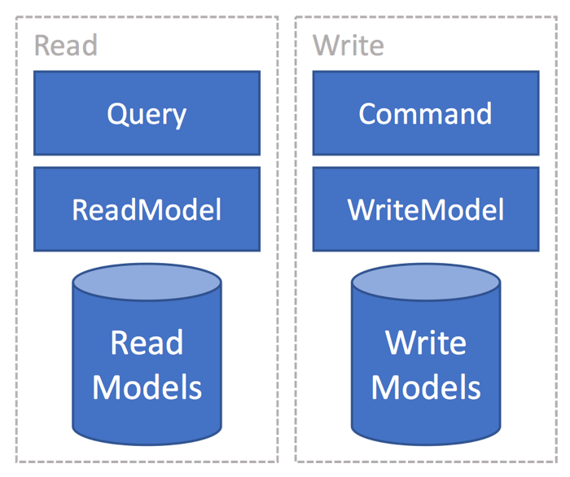

# Principles

## SOLID

The [SOLID principles](https://en.wikipedia.org/wiki/SOLID_(object-oriented_design)) aims to make it easier to create more maintainable software.

### Single Responsibility Principle

Every class and method should have a single responsibility.

### Open / Closed Principle

Systems and its entities should be open for extension, but closed for modification.
A good examples of this is how you can extend your system quite easily by just putting in new [event processor](./event_processor.md)
without having to change the internals of the system.

### Liskov Substition Principle

Objects in a program should be replacead with instances of their subtypes without altering the correctness of that program.
An example of something follows this is for instance the [event store](./event_store.md).
It has multiple implementations and the contract promises what it can do, implementations need to adhere to the contract.

### Interface Segregation Principle

Interfaces should represent a single purpose, or concerns. A good example in .NET would be ``IEnumerable`` and ``ICollection``.
Where ``IEnumerable`` concerns itself around being able to enumerate items, the ``ICollection`` interface is about modifying
the collection by providing support for adding and removing. A concrete implementation of both is ``List``.

### Dependency Inversion Principle

Depend on abstractions, not upon the conrete implementations.
Rather than a system knowing about concrete types and taking also on the responsibility of the lifecycle of its dependencies.
We can quite easily define on a constructor level the dependencies it needs and let a consumer provide the dependencies.
This is often dealt with by introducing an [IOC](https://en.wikipedia.org/wiki/Inversion_of_control) container into the system.
You can read more about that [here](inversion_of_control.md).

## Seperation of Concerns

Another part of breaking up the system is to identify and understand the different concerns and separate these out.
An example of this is in the frontend, take a view for instance. It consists of flow, styling and logic. All these are
different concerns that we can extract into their own respective files and treat independently; HTML, CSS, JavaScript.

Read more in details about it [here](https://en.wikipedia.org/wiki/Separation_of_concerns).

## Decoupling & Microservices

At the heart sits the notion of decoupling. Making it possible to take a system and break it into small focused lego pieces
that can be assembled together in any way one wants to. This is at the core of what is referred to as
[Microservices](https://en.wikipedia.org/wiki/Microservices). The ability to break up the software into smaller more digestable components
that makes our software in fact much easier to understand and maintain. When writing software in a decoupled manner, one gets the
opportunity of composing it back together however one sees fit. You could compose it back in one application running inside a single
process, or you could spread it across a cluster. It really is a deployment choice once the software is giving you this freedom.
When it is broken up you get the benefit of scaling each individual piece on its own, rather than scaling the monolith
equally across a number of machines. This gives a higher density, better resource utilization and ultimately better cost
control.

## Conventions over Configuration

For a team to deliver consistency in the codebase, one should aim for a recipe that makes it easy to the right thing and
hard to the wrong thing. Having conventions to govern the recipe forces the team to deliver more consistently. Since things can be
discovered and one does not need to configure everything, we adhere more easier to the Open / Closed principle as mentioned earlier. 
Meaning that we don't have to open up code to get new things in place, it will be discovered by how the conventions are and configured.

The simplest example of a convention in play is during initialization, the [IOC container](https://en.wikipedia.org/wiki/Inversion_of_control)
gets set up with conventions. One default convention plays a part here saying that an interface named ``IFoo``will be bound to ``Foo``
as long as they both sit in the same namespace. A concrete example could be from the infrastructure where you have ``IEventPublisher``automatically
associated with the ``EventPublisher``implementation.

## CQRS

Most systems has different requirements for the read and the write part of each bounded context. The requirements vary on what is
needed to be written in relation to what is being read and used. The performance characteristics are also for the most part different.
Most line-of-business applications tend to read a lot more than they write. [CQRS](https://en.wikipedia.org/wiki/Command–query_separation#Command_Query_Responsibility_Segregation)
talks about totally segregating the read from the write and treat them uniquely.

You can read more about commands [here](./commands.md).

## Other

There are much more at play, such as the focus around [events](./events.md) and being [event driven](./event_driven.md) and having this
source of truth be stored in an [event store](./event_store.md). Also at the core is the concept of [bounded contexts](bounded_contexts.md).