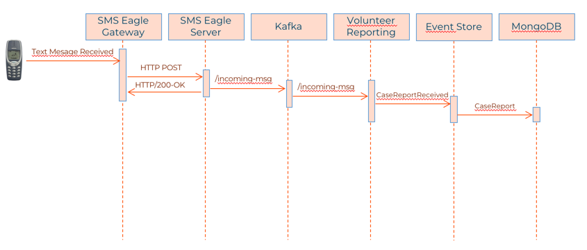
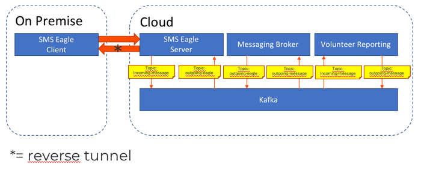
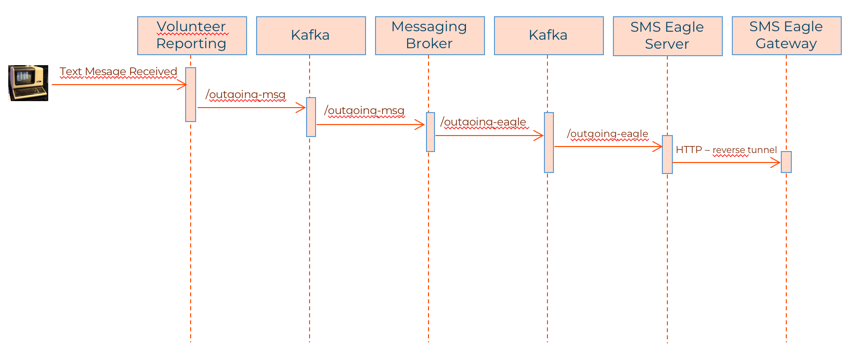
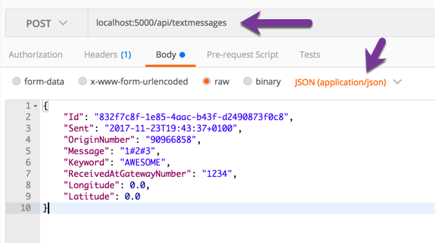

# Sms

This file holds details on how the Sms project works, its infrastructure, architecture and how to work with it.

## Hardware

The hardware that gets deployed needs to be able to take SMS and send it to the cloud over internet.
It also must be able to be connecting to the cloud and receive messages sent from the solution.
The connection should be outbound and not need an opening in a firewall on-premise in the installation country.
The reason for this is that it complicates the installation requirements and could potentially mean that its
harder to get working.

The choice has been made to go for [SMS Eagle](https://www.smseagle.eu/). A device based on Raspberry PI with
a [raspbian](http://raspbian.org) deployment and custom software on top. It enables the scenarios we want.


## Architecture

Below is a diagram describing the overall architecture with Volunteer Reporting as a sample.


The flow diagram for this is as follows:



Combining it with the ability to send text messages from the solution you get the following:



And its flow diagram:



## Infrastructure

When running any of the bounded contexts where there is a dependency on SMS you should add a dependency to the
`./Source/Infrastructure/TextMessaging` project. This will automatically hook you up for receiving messages.
To consume textmessages all you have to do in code is to drop in a class that implements the interface
`ICanProcessTextMessage` - you will automatically be hooked up and be called when a text message is received.

```csharp
using Infrastructure.TextMessaging;

public class MyTextMessageProcessor : ICanProcessTextMessage
{
    public void Process(TextMessage textMessage)
    {
        // do your processing
    }
}
```

## Testing locally

There is a REST endpoint that can be used by adding a dependency to the `TextMessaging.Web` project.
This project adds a route `/api/textmessages` that accepts a post.
All projects are instrumented with a Swagger endpoing when in development, you can easily find the
textmessaging endpoint in there by navigating to `http://localhost:5000/swagger` when running one
of the bounded contexts on your local dev machine.

### Format

The class definition of a `TextMessage` looks as follows:

```csharp
public class TextMessage
{
    public Guid Id { get; set; }
    public DateTimeOffset Sent { get; set; }
    public string OriginNumber { get; set; }
    public string Message { get; set; }
    public string Keyword { get; set; }
    public string FullMessage { get; set; }
    public string ReceivedAtGatewayNumber { get; set; }
}
```

A JSON representation of this looks as follows:

```json
{
    "Id": "<guid>",
    "Sent": "<date time - UTC>",
    "OriginNumber": "string - originating number",
    "Message": "string - actual message",
    "Keyword": "string - keyword used - if any",
    "FullMessage": "string - actual full message",
    "ReceivedAtGatewayNumber": "string - number sent to"
}
```

### Postman

You can use tools like [Postman](https://www.getpostman.com/) to send yourself textmessages.
Very convenient in development.



### Kafka

The entire system is built with Kafka for messaging and text messages coming in from the SMS Eagle is in fact put
directly onto a topic in Kafka. In order to test with a real SMS scenario, you need Kafka working. 
The number in which you can send to is then **+47 906 38 257**.

#### Hosts

Kafka is set up to respond to a specific DNS name and everything honors this. This particular name is not
accessible to the host - your machine. In order for us to be able to from local processes connect to Kafka,
we need to add an entry to the operating systems hosts file.

In your hosts file we need to map `kafka-service` to the IP of the Kafka CBS Dev instance.
On a unix system you can edit the hosts file like so:

```shell
$ sudo nano /etc/hosts
```

On a Windows system, this file is located in the `c:\Windows\System32\drivers\etc\hosts` - edit using Notepad or your favorite editor.

You can also use `code`, `pico` or any other editor to edit that file.

Add the following line:

```
52.178.92.69  kafka-service
```

The IP address should correspond to the IP of the Kafka instance. On the CBS Dev cluster, it is `52.178.92.69`.
